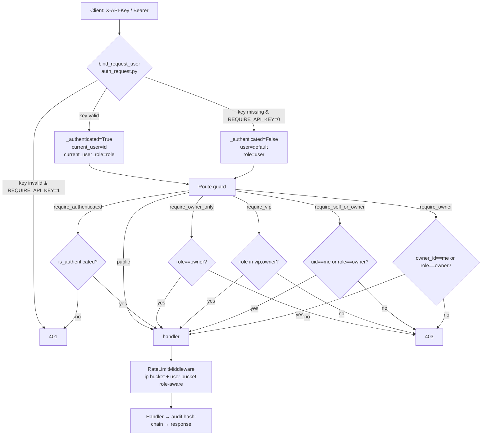
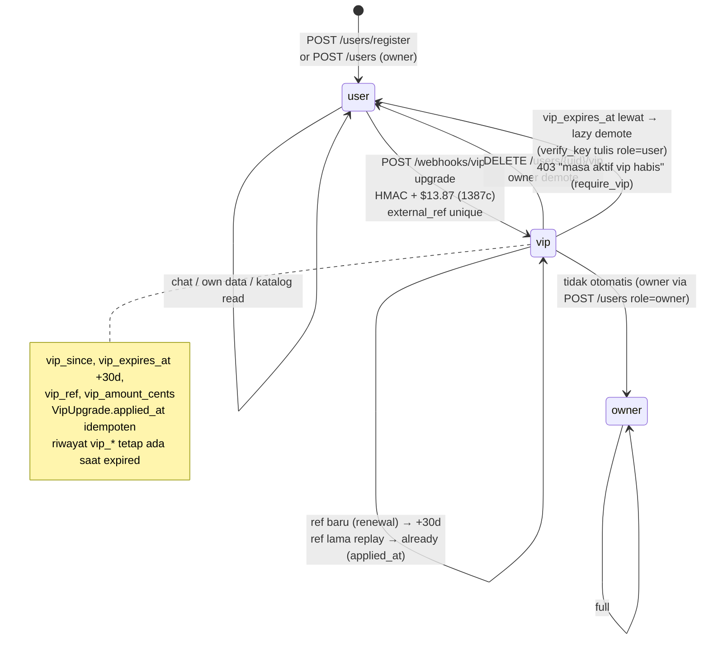
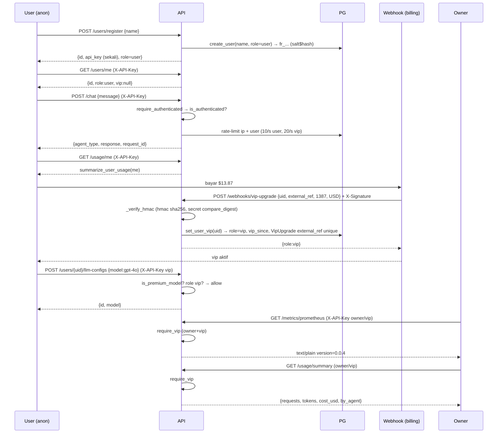

# Authorization Diagram — ayesh-core 2.1 (owner / vip / user)

## 1. Request → Auth → Guard → Handler



## 2. Role & Upgrade Flow



## 3. Register → Chat → Usage → VIP



## 4. Guard Matrix (warna) — final: user manage=owner, global=vip, model=self

```mermaid
flowchart LR
    subgraph Public [Publik tanpa key]
        P1[GET /health]
        P2[POST /users/register]
        P3[POST /webhooks/vip-upgrade<br/>HMAC]
    end
    subgraph AuthRead [Authenticated read<br/>user/vip/owner]
        A1[GET /agents /skills /marketplace<br/>GET /templates preview]
        A2[POST /chat /feedback]
    end
    subgraph SelfOwner [Model manage: Self ∨ owner<br/>+ premium gate]
        S1[GET /users/{uid}/llm-*, skill, mcp<br/>GET /usage/user/{uid} self<br/>GET /usage/me]
        S2[GET /sessions /plans /memory<br/>POST /tasks /jobs<br/>GET /approvals]
    end
    subgraph OwnerOnly [Owner-only: user manage]
        O1[GET /users<br/>DELETE /users/{uid}<br/>POST /users<br/>POST /users/{uid}/rotate]
        O2[POST /users/{uid}/vip<br/>DELETE /users/{uid}/vip]
        O3[GET /logs<br/>GET /feedback/stats|recent]
    end
    subgraph Vip [Vip = owner+vip]
        V1[POST DELETE /keywords<br/>GET /keywords]
        V2[POST /templates<br/>DELETE /templates/{name}]
        V3[POST DELETE /marketplace/*]
        V4[GET /audit /audit/verify<br/>GET /analytics<br/>GET /usage/summary /recent<br/>GET /metrics /metrics/prometheus]
    end
    Public --- AuthRead --- SelfOwner --- OwnerOnly --- Vip
```

## 5. Rate Limit — role-aware

```mermaid
flowchart TD
    R[Request path → scope<br/>_scope_for_path] --> IP[IP bucket<br/>RATE_LIMIT_{SCOPE}_BURST/SUSTAINED]
    R --> U{Authenticated?}
    U -->|no| IP
    U -->|yes + role=user| UB[user limits<br/>_user_limits<br/>USER_BURST/SUSTAINED]
    U -->|yes + role=vip/owner| VB[vip limits<br/>_vip_limits<br/>VIP_BURST = USER*2<br/>SUSTAINED = USER*4]
    IP --> C1{burst/sustained > limit? 429}
    UB --> C2{burst/sustained > limit? 429}
    VB --> C3{burst/sustained > limit? 429}
    C1 -->|no| OK[handler]
    C2 -->|no| OK
    C3 -->|no| OK
```

- Scope: `chat 10/30`, `tasks|jobs|approvals|feedback 5/20`, `users 2/5`, `register 2/5`, `webhooks 5/20`, `health 10/30` — override via `RATE_LIMIT_{SCOPE}_{USER|VIP}_*`.

## 6. DB Schema delta

```mermaid
erDiagram
    users {
        varchar id PK
        varchar name
        varchar key_hash
        varchar prefix
        varchar role  """owner|vip|user|admin(legacy)"""
        boolean active
        timestamp created_at
        varchar old_key_hash
        varchar old_prefix
        timestamp old_key_expires_at
        timestamp vip_since
        timestamp vip_expires_at
        varchar vip_ref
        int vip_amount_cents
    }
    vip_upgrades {
        varchar id PK
        varchar user_id FK
        varchar external_ref UK
        int amount_cents
        varchar currency
        timestamp created_at
    }
    users ||--o{ vip_upgrades : "user_id"
    users ||--o{ user_llm_configs : "user_id"
    users ||--o{ user_skill_overrides : "user_id"
    users ||--o{ user_mcp_overrides : "user_id"
```

---
*Diagram Mermaid — render di GitHub / Mermaid Live Editor. Semua panah 401/403 fail-closed.*

